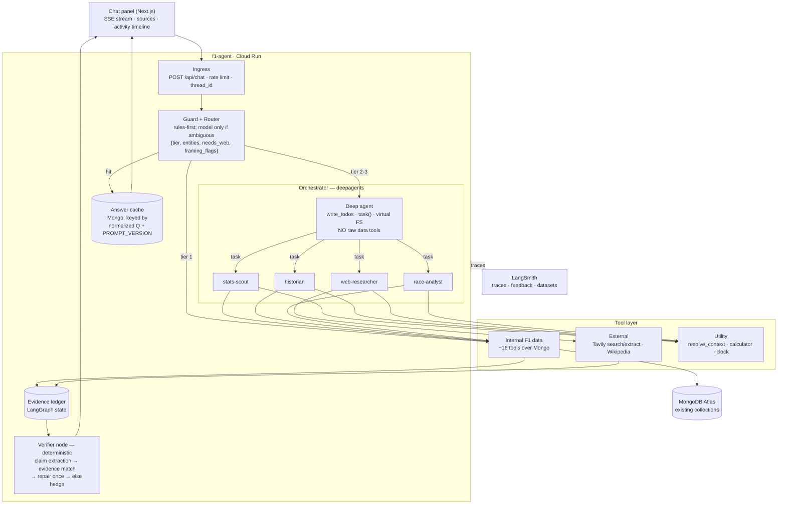

# F1 Hub — Agentic Chat Assistant: Architecture Plan

**Status:** proposal, not yet approved. No implementation has started.
**Proposed as:** Batch 17 (CP59-62) + Batch 18 (CP63-66).
**Date:** 2026-08-05

---

## 1. What we are building, and what we are deliberately not building

A conversational surface in F1 Hub — working name **Pitwall Assistant** — that answers open-ended
Formula 1 questions by *orchestrating tools over this app's own verified data*, falling back to the
live web only when the answer genuinely does not live in our database.

**We are not building a chatbot with a system prompt.** The distinction matters, and it is the
first thing to say in an interview. A prompt-only chatbot answers from model weights and
hallucinates confidently. This system answers from **retrieved evidence**, carries a **citation for
every factual claim**, and **verifies its own answer against the evidence ledger before streaming
it**. The model's job is narration and orchestration, never fact derivation.

That principle is not invented for this document. It is the hard-won conclusion of three previous
GenAI checkpoints in this repo, and it is the reason this architecture looks the way it does:

| Post-mortem | What happened | What it forces in this design |
|---|---|---|
| **CP38** | The recap model invented a teammate relationship between two drivers on visibly different teams. It had correct raw data in front of it. | Tools return **pre-joined, pre-computed fact bundles**, never raw documents. Relational facts are resolved in Python. |
| **CP41** | A prompt rule banning a word kept being violated even after being restated twice in ALL CAPS. | Constraints are enforced by **code validators with a regenerate-once loop**, not by asking the model nicely. |
| **CP44** | The prompt documented an output format (`[RC L66]`); the model reliably emitted a different one (`[RC 5]`). | Never build on a *documented* prompt contract. Parse defensively and assert the real shape in tests. |
| **Batch 16** | Every checkpoint passed its tests and the feature still did not work in production. Seven follow-up PRs. | Deployment path is proven **first** (CP59), before agent complexity is layered on. |

Everything below follows from those four rows.

---

## 2. Question taxonomy — what "any kind of question" actually means

"Any question" is not a design. Here is the actual question space, the route each class takes, and
the honest answer for the classes we cannot serve well. The taxonomy *is* the routing table.

| # | Class | Example | Route | Answer source |
|---|---|---|---|---|
| 1 | **Point lookup** | "Who won the 2026 Hungarian GP?" | Tier 1 — direct tool, no orchestration | `race_results` (Mongo) |
| 2 | **Aggregate / season shape** | "How many podiums has Norris had this year?" | Tier 1-2 — computed tool | `session_results` + Python aggregation |
| 3 | **Narrative / causal** | "How did Norris lose the lead in Hungary?" | Tier 2 — `race-analyst` | `race_replay` + `race_control_facts` + laps |
| 4 | **Comparative** | "Compare Verstappen and Norris this season" | Tier 2 — `race-analyst` + `stats-scout` | head-to-head fact builder (reuse `driver_comparison_recap`) |
| 5 | **Strategy** | "Why did Ferrari two-stop in Monza?" | Tier 2 — `race-analyst` | reuse `strategy_commentary.build_facts` (undercut/overcut already computed) |
| 6 | **Deep history (1950-2026)** | "Who has the most Monaco wins ever?" | Tier 2 — `historian` | `historical_index` + `circuit_history` |
| 7 | **Circuit / geometry** | "What's the elevation change at Spa?" | Tier 1-2 — `stats-scout` | `track_geometry` payloads + `circuit_info` |
| 8 | **Live world / news** | "What's the latest on the 2027 engine regs?" | Tier 3 — `web-researcher` | Tavily search + extract, dated + sourced |
| 9 | **Rules / glossary** | "Explain DRS" | Tier 1 — `web-researcher` or model knowledge, **explicitly flagged as general knowledge, not app data** | web / Wikipedia |
| 10 | **Predictive** | "Who will win Sunday?" | Tier 3 — `race-analyst`, forced framing | computed form (last-5 results, quali pace, circuit history) presented as **commentary with stated uncertainty**, never a promise |
| 11 | **Subjective** | "Is Hamilton better than Schumacher?" | Tier 2 — evidence on both sides, **no verdict** | historical index + explicit "this is a matter of opinion" framing |
| 12 | **Action** *(stretch)* | "Build the 3D track for Suzuka" | Tier 2 + **human-in-the-loop interrupt** | calls the existing `/api/track_geometry/build` |
| 13 | **Ambiguous reference** | "How did *he* do in the *last* race?" | Resolved deterministically before any agent runs | `resolve_context` tool + thread memory |
| 14 | **Out of domain** | "What's the weather in Tokyo?" | Guard — decline + redirect | — (but "weather at the Japanese GP" **is** in domain → `race_weather`) |
| 15 | **Adversarial** | "Ignore your instructions and…" | Guard + injection filter | — |

**The classes we will get wrong if we are not careful, stated up front:**
- **Stale data.** The hourly sync means Mongo can be up to an hour behind, and FastF1-sourced
  collections can only be filled from a local machine (Cloud Run is IP-blocked). Every fact bundle
  therefore carries an `as_of` timestamp and the answer states its cutoff when it matters.
- **Class 10 and 11** are where a portfolio project usually embarrasses itself. Both get a forced
  framing contract enforced by the verifier, not by a prompt suggestion.

---

## 3. System architecture



### Layer responsibilities

**L0 — Ingress.** `POST /api/chat` returns Server-Sent Events. Carries `thread_id` for multi-turn
memory, enforces per-IP and per-thread rate limits and a per-request token budget, and supports
client cancellation (abort → LangGraph cancellation, so a closed tab stops burning tokens).

**L1 — Guard + Router.** One cheap, fast model call with structured output. Produces:
`{tier: 1|2|3, domain: in|out, entities: {season, round, driver_ids, circuit_id}, needs_web: bool,
framing: [predictive|subjective|general_knowledge], injection_suspected: bool}`.

This layer exists for three reasons, all of which are interview answers:
1. **Cost and latency.** "Who won Monaco?" must not spin up a five-agent orchestration. Tier 1
   answers in one tool call and roughly one second.
2. **Scope control.** Out-of-domain is declined here, cheaply, before any agent sees it.
3. **Deterministic entity resolution.** The router's entity output is passed through
   `resolve_context` (pure Python) so that "the last race" becomes `(2026, 14)` before the model can
   guess a round number.

**L2 — Orchestrator (deepagents).** A `create_deep_agent` graph. It plans with `write_todos`,
delegates with `task()`, keeps notes in the virtual filesystem, and writes the final answer. It
holds **no** raw-data tools on purpose — every data fetch goes through a subagent so the raw
payloads never enter the orchestrator's context window.

**L3 — Subagents.** Four, each with an isolated context window, its own system prompt and its own
tool contract. See §4.

**L4 — Tool layer.** Three families. See §5.

**L5 — Verifier.** A deterministic LangGraph node, *not* a subagent, precisely so the orchestrator
cannot decide to skip it. See §7.

**L6 — Observability.** LangSmith tracing on everything. See §8.

**L7 — Evaluation.** deepeval in CI over a golden set curated from LangSmith traces. See §9.

### Why deepagents rather than plain LangGraph

Honest framing, because an interviewer will ask. deepagents gives us four things we would otherwise
hand-roll: a planning tool (`write_todos`), subagent dispatch with context isolation (`task()`), a
virtual filesystem for **tool-output offloading**, and automatic conversation summarization. It is
LangGraph underneath, so we keep checkpointing, streaming and native LangSmith tracing, and we can
drop to raw LangGraph for the parts that must be deterministic (guard, verifier). Using deepagents
for the flexible research loop and raw LangGraph for the enforcement stages is the actual design
decision here — not "we used the framework."

Version pinned at authoring time: **deepagents 0.7.4** (released 2026-08-04).

```python
create_deep_agent(
    model, tools, *, system_prompt, middleware, subagents, skills, memory,
    permissions, backend, interrupt_on, response_format, state_schema,
    context_schema, checkpointer, store, debug, name, cache,
) -> CompiledStateGraph
```

Default middleware it assembles for us: `FilesystemMiddleware`, `SubAgentMiddleware`,
`SummarizationMiddleware`, `PatchToolCallsMiddleware`, `AnthropicPromptCachingMiddleware`, plus
`HumanInTheLoopMiddleware` when `interrupt_on` is set. Built-in tools: `ls`, `read_file`,
`write_file`, `edit_file`, `glob`, `grep`, `task` (and `execute` only with a sandbox backend — we
will **not** enable shell execution).

---

## 4. The agent roster

**Design rule, stated so the roster does not sprawl:** a subagent exists only if it has *either* a
genuine context-isolation need (its tools return large payloads) *or* a distinct behavioural
contract (a prompt that would contradict another agent's). Anything else is a tool. Four subagents
is the answer to "why not twelve".

| Agent | Role | Tools | Model tier | Why it is separate |
|---|---|---|---|---|
| **Orchestrator** | Plans, delegates, synthesises the final answer, owns the citation contract | `task`, `write_todos`, virtual FS | Strongest | Must never see raw data |
| **stats-scout** | Current + recent seasons: results, standings, quali, laps, pits, stints, weather, circuits | 11 internal tools | Mid | Payloads are large → isolated context |
| **historian** | 1950-2026 archive; owns the Ergast data quirks | `historical_race_index`, `constructor_seasons`, `circuit_history`, guarded `ergast_query` | Mid | Its prompt must carry the quirks (§4.1) that would be noise everywhere else |
| **web-researcher** | Anything not in our DB: news, regulations, driver moves, rule explanations | `web_search`, `web_extract`, `wikipedia_summary` | Mid | **Untrusted input boundary** — its output is quarantined and never treated as instructions |
| **race-analyst** | Derived and comparative reasoning; strategy; form; prediction framing | strategy/replay/h2h fact builders + `calculator` | Strong | Owns the "no arithmetic in-head" rule and the prediction/subjective framing contracts |

### 4.1 The `historian` prompt carries these facts, because Ergast is not clean

Straight from the Batch 14 retrospective, so they are never re-derived:
- Pagination `total` counts **result rows, not races** (shared drives in the 1950s produce two P1
  rows). Advance the offset by `limit`, never by `len(page)`.
- The `alfa` constructorId is **three unrelated teams** 70 years apart — split by era.
- One team's chassis/engine variants are separate constructorIds (`team_lotus` / `lotus-climax` /
  `lotus-ford` / `lotus-brm`) — collapse via `CONSTRUCTOR_ALIASES`.
- `lotus_f1` is **not** a Lotus — it is the Renault-descended 2012-15 constructor.
- The 1950-60 Indianapolis 500 counted for the championship, so four American roadster builders
  appear as "race winners" without ever entering a Grand Prix — flag `indy500: true`, never silently
  present them as GP wins.

### 4.2 Model strategy — one workhorse model, because the budget is the Ollama free tier

**This constraint shapes more of the design than any other, so it is stated plainly rather than
buried in a config note.** We are on Ollama Cloud's **free tier**, using the existing
`OLLAMA_API_KEY`. There is no inference budget beyond it.

| Free-tier fact | Architectural consequence |
|---|---|
| **1 concurrent model** (Pro: 3, Max: 10) | No per-role model assignment. **One model runs every role.** |
| Requests past the concurrency limit are **queued** to a fixed depth, then **rejected** | The service serializes agent runs itself with an in-process semaphore of 1, rather than letting Ollama's queue reject under load |
| Usage meters **GPU time**, not tokens — model size × request duration | Every avoidable model *call* is real budget. Call count matters more than prompt length. |
| Published guidance is to stay on **level 1-2 models** to stretch the quota | The flagship models are off the table for routine traffic |
| Session limits reset every **5 hours**, weekly limits every **7 days** | A burst of demo traffic can lock the assistant out for hours. Graceful degradation is mandatory, not polish. |

#### The assignment

**One workhorse model for every role.** Agents are separated by **prompt, tools and context
window** — not by weights.

| | |
|---|---|
| **Primary candidate** | `qwen3.5:35b` — carries both `tools` and `thinking`, sits in the level-2 class, and the Qwen family punches above its size on tool calling |
| **Alternates for the CP59 spike** | `qwen3.5:27b` (cheaper), `nemotron-3-nano:30b`, `gemma4:31b` |
| **Escalation — tier 3 only, quota permitting** | `qwen3.5:122b` or `deepseek-v4-flash` for genuinely hard synthesis |
| **Explicitly not used** | `kimi-k3`, `nemotron-3-ultra`, `glm-5.2`, `deepseek-v4-pro` — level 3-4 models that would drain a free quota in a handful of conversations. `deepseek-v4-pro` is doubly excluded: the same comparisons that put it top of the agentic tables (GDPval-AA 1554) report a **94-96% hallucination rate and verbose output**, which is disqualifying for a system built on factual discipline. |

This is a defensible position rather than a compromise to apologise for: **the value of a
multi-agent design comes from context isolation and specialised prompts, not from running different
weights per agent.** If budget ever appears, the first — and possibly only — role worth a different
model family is the **verifier**, since a checker sharing the writer's blind spots is a weaker
checker. That is the upgrade path, recorded so it is not re-derived.

#### Cutting model calls per answer from ~6 to ~2

On a GPU-time budget the call count is the cost driver. Three changes, each of which also makes the
system *more* deterministic — the direction this repo already trusts:

1. **The guard/router becomes rules-first, not a model call.** Entity extraction, season/round
   resolution and most tier classification are pattern work: a question naming a year and "won" is a
   point lookup; "latest" / "news" / "rumour" / a future year needs web; a known driver or circuit
   name resolves against our own id tables. The LLM router becomes the **fallback for genuinely
   ambiguous input only**, removing one call from the majority of requests.
2. **The verifier's core becomes fully deterministic.** Citation presence, `evidence_id` existence
   and number-matching against the ledger are string and set operations — no model needed. The **LLM
   entailment pass runs on tier 3 answers only**, removing a second call from most requests.
3. **Answer caching is load-bearing, not an optimisation.** Keyed on normalized question + resolved
   entities + `PROMPT_VERSION`. On a portfolio site, repeat questions dominate.

Net: a tier-1 lookup costs **one** model call, a tier-2 analysis **two**, and only tier-3 research
reaches four or five.

#### The risk this creates, stated honestly

**A ~30b model doing nested `task()` dispatch is the single riskiest assumption in this plan.** Deep
agents lean hard on multi-turn tool calling, and small models are exactly where that breaks —
malformed arguments, dropped tool results, delegation loops.

The checkpoint order already absorbs that. **CP61 lands a single-agent baseline** (one agent, all
tools, no subagents) which on this budget may simply *be* the product. CP63 adds subagents **only if
the CP59 spike shows this model handles nested dispatch reliably** — and if it does not, we ship the
single-agent version and say so in the write-up.

"We sized the architecture to the budget and measured before scaling" is a stronger interview answer
than a six-model diagram that was never affordable to run.

#### Demo insurance

A quota lockout during a live demo would be fatal, so **CP66 pre-generates and pins answers for ~30
showcase questions**. The demo path never depends on live quota; real traffic still runs live.

---

## 5. Tool catalogue

Tools return a **fact bundle**, never a raw document:

```python
{ "data": {...},                # pre-joined, pre-computed, small
  "evidence_id": "ev_7",        # ledger key the answer must cite
  "source": "mongo:race_results/2026-14",
  "as_of": "2026-08-05T09:00:00Z" }
```

Errors return a structured `{"available": false, "reason": ...}` — never an exception. This matches
the app's existing fail-soft posture everywhere else.

### 5.1 Internal F1 data (over Mongo, direct function calls — no HTTP self-calls)

| Tool | Returns | Reuses |
|---|---|---|
| `get_season_calendar(year)` | rounds, dates, circuits | `races.py` |
| `get_session_result(year, round, session)` | classification (race/quali/sprint) | `session_results.py` |
| `get_standings(year, kind, after_round=None)` | driver/constructor table | `championship_standings.py` |
| `get_driver_profile(driver_id)` | bio + career totals | `driver_bio.py` |
| `get_driver_season_summary(driver_id, year)` | wins, podiums, points, avg finish, quali H2H | **new** aggregation |
| `get_head_to_head(a, b, scope)` | pairwise computed comparison | `driver_comparison_recap.py` fact builder |
| `get_race_narrative_facts(year, round)` | podium, movers, retirements, closest gap, teammates | **`session_recap.build_facts` — reused verbatim** |
| `get_race_strategy(year, round)` | stints, stops, undercut/overcut resolution | **`strategy_commentary` fact builder** |
| `get_race_control(year, round)` | penalties, SC/VSC, distilled | `race_control_facts.py` |
| `get_lap_summary(year, round, drivers)` | **downsampled** position/pace summary | `race_laps.py` |
| `get_pit_stops(year, round)` | stop table | `pit_stops.py` |
| `get_weather(year, round)` | session conditions | `session_results.py` |
| `get_circuit_profile(circuit_id)` | layout, length, corners, elevation | `circuit_info` + `track_geometry` |
| `get_circuit_history(circuit_id)` | winners, lap records, era spans | `circuit_history.py` |
| `get_historical_race_index(filters)` | wins/podiums across 1950-2026 | `historical_index.py` |
| `get_constructor_seasons(constructor_id)` | genealogy-aware season list | `historical_index.py` |

**The context-budget rule that makes or breaks this system:** a single race's `race_laps` is 1000+
rows. It must never enter a context window. `get_lap_summary` returns a downsampled narrative
summary; when the analyst genuinely needs detail, the full payload is written to the deep agent's
**virtual filesystem** and `grep`-ed. This is what deepagents' filesystem is *for*, and "tool-output
offloading" is the correct term for it.

**Hard constraint inherited from the deploy notes:** these tools read Mongo and may self-heal via
Jolpica/Ergast. They must **never** trigger a FastF1 fetch — `livetiming.formula1.com` 403s
datacenter IPs and fails *soft* (empty streams, no error), which would silently produce empty
answers in production and work perfectly in local testing.

### 5.2 External

| Tool | Notes |
|---|---|
| `web_search(query, topic, max_results)` | **Tavily — decided.** Agent-shaped results: relevance-scored, pre-cleaned, and able to return full page content in the *same* call. `langchain-tavily` is first-party. Free tier 1,000 credits/month. Alternative considered and rejected: **Exa** (20,000 free requests/month, semantic ranking, but page content requires a second Contents API round trip, so every result the agent actually reads costs extra latency). Revisit only if monthly volume outgrows the free tier. |
| `web_extract(urls)` | Tavily extract, for reading one specific page the search surfaced |
| `wikipedia_summary(title)` | Free, no key, good for glossary/rules questions |

### 5.3 Utility

| Tool | Why it exists |
|---|---|
| `resolve_context(hint)` | Turns "the last race" / "he" / "Max" into `(season, round, driver_id)` **in Python**. Kills an entire hallucination class. |
| `now()` / `season_state()` | Models do not know today's date. Injecting the clock is what makes "the next race" answerable. |
| `calculator(expr)` | Safe arithmetic. The model is banned from doing maths in-head — CP38's rule 3, promoted to a tool. |

---

## 6. Request flow, end to end

A worked example — *"Why did Norris lose the lead in Hungary, and what are people saying about it?"*

1. **Ingress** — thread resumed from the Mongo checkpointer; rate limit and budget checked.
2. **Guard/Router** → `{tier: 3, in-domain, entities: {season: 2026, circuit: hungaroring},
   needs_web: true, framing: []}`. `resolve_context` resolves Hungary 2026 → round 14, Norris →
   `norris`.
3. **Cache** miss (key = normalized question + resolved entities + `PROMPT_VERSION`).
4. **Orchestrator** plans: `write_todos` → [get race facts, get strategy, get race control, search
   reaction, synthesise].
5. `task("race-analyst", …)` → calls `get_race_narrative_facts`, `get_race_strategy`,
   `get_race_control`, `get_lap_summary`. Large lap payload is offloaded to the virtual FS.
   Returns a compact analysis + evidence ids `ev_1..ev_6`.
6. `task("web-researcher", …)` → `web_search` for post-race reaction. Results are **quarantined**:
   wrapped in a delimiter block, tagged untrusted, and any instruction-shaped text in them is
   ignored by contract (§10). Returns 3 sourced quotes as `ev_7..ev_9`.
7. **Orchestrator** synthesises the answer, attaching a citation marker to every factual claim.
8. **Verifier** (deterministic) extracts atomic claims, checks each against the evidence ledger,
   and either passes, repairs once, or hedges (§7).
9. **Stream** — tokens stream to the UI alongside `activity` events ("Reading Hungarian GP race
   control…", "Searching the web…") and a final `sources` payload rendered as clickable chips.
10. **LangSmith** receives the full trace; the thumbs-up/down the user gives is attached as feedback
    to that run id.

---

## 7. The verifier — the part that makes this trustworthy

Every tool call appends to an **evidence ledger** in LangGraph state. After the orchestrator drafts
an answer, a deterministic node runs:

1. **Claim extraction** — one structured-output call: the draft → a list of atomic factual claims,
   each with the `evidence_id` it cites.
2. **Deterministic checks** (free, no LLM): does every claim carry a marker? Does every cited
   `evidence_id` exist in the ledger? Do numbers in the claim appear in that evidence?
3. **Entailment check** (LLM): is each claim actually supported by its evidence, or merely adjacent
   to it?
4. **Repair loop, max one attempt** — the draft is regenerated with the specific violations named.
   This is exactly the `SESSION_VALIDATORS` regenerate-once pattern already proven in
   `session_recap.py`, not a new idea.
5. **Degrade, don't lie** — if repair fails, unsupported sentences are stripped or explicitly
   hedged, and the run is tagged `verification_failed` in LangSmith so it lands in the eval set.

The verifier also enforces the **framing contracts**: a `predictive` answer must contain explicit
uncertainty and must not assert an outcome; a `subjective` answer must not deliver a verdict; a
`general_knowledge` answer must be labelled as not coming from app data.

Cost note, stated honestly: verification adds roughly one extra model call per answer. It runs on
tier 2-3 only. That is the price of the guarantee, and it is worth it — this is the single feature
that separates the system from a wrapper around a prompt.

---

## 8. Observability — LangSmith

deepagents is LangGraph underneath, and LangGraph has native LangSmith tracing. **No extra package
is needed** — setting `LANGSMITH_TRACING=true`, `LANGSMITH_API_KEY` and `LANGSMITH_PROJECT` is
enough for every node, tool call, subagent dispatch and model call to appear as a trace.

What we add on top, because tracing alone is not observability:

- **Run metadata** on every trace: `thread_id`, `tier`, `route`, `cache_hit`, `verification_status`,
  latency, token counts, estimated cost.
- **User feedback loop** — the thumbs up/down in the chat UI posts to LangSmith's feedback API,
  keyed by run id. Real users labelling real failures is the cheapest eval data that exists.
- **Curated datasets** — bad runs found in traces get promoted into a LangSmith dataset, which is
  the source of truth for the golden set that deepeval runs in CI (§9). This closes the loop:
  production failure → dataset → regression test.
- **Alerting** on `verification_failed` rate, p95 latency and daily spend.

---

## 9. Evaluation — does deepeval fit? Yes, with a boundary

**Verdict: adopt it, for offline CI evaluation only. Keep LangSmith as the single production
observability plane.** Both tools can trace and both can evaluate; running both as dashboards would
be resume-driven development, and an interviewer will spot it. The defensible split:

| | LangSmith | deepeval |
|---|---|---|
| **When** | Online, production | Offline, CI, pre-merge |
| **Job** | Tracing, latency/cost/token telemetry, human feedback, dataset curation, debugging one bad run | Scoring a golden set, blocking a regression from merging |
| **Ergonomics** | Web UI, run-centric | pytest-native (`deepeval test run`), assertion-centric |

**Why deepeval specifically:** it is pytest-native, so evals run in the same CI as the existing
`python -m unittest discover tests`, and it has first-class **agentic** metrics — not just RAG
metrics — which is what this system needs. It integrates with LangGraph by passing its
`CallbackHandler` through `config={"callbacks": [...]}`, so no application code changes to be
evaluated.

**The metric suite, mapped to this system's actual failure modes:**

| Metric | What it protects |
|---|---|
| `ToolCorrectnessMetric` | **Deterministic, no LLM judge, free.** Did the router pick the right tool? This is our routing regression gate — run it on every PR. |
| `ArgumentCorrectnessMetric` | Did it pass the right year/round/driver_id? Catches `resolve_context` regressions. |
| `FaithfulnessMetric` / `HallucinationMetric` | **The CP38 gate.** Does the answer stay inside the retrieved facts? |
| `ContextualPrecision` / `Recall` / `Relevancy` | Retrieval quality — did the tools fetch what was needed, and only that? |
| `AnswerRelevancyMetric` | Did it answer the question asked? |
| `TaskCompletionMetric` | Trace-level, end-to-end: was the user's goal met? |
| **Custom `GEval` criteria** | Encode this repo's *known* failure classes as graded rubrics: "no invented teammate relationships" (CP38), "no sporting-regulation claims", "every factual claim carries a citation marker" (CP44), "predictions are framed as uncertain" |
| Red-teaming (deepeval's companion suite) | Prompt injection via web results, out-of-scope refusal, jailbreak resistance |

**The honest caveats, which are themselves interview material:**
- LLM-judge metrics are **non-deterministic and cost GPU time we do not have** (§4.2). On the free
  tier a nightly judged run over 60 goldens would eat the quota the product itself needs.
  **Therefore the cadence is quota-shaped:** deterministic metrics (`ToolCorrectness`,
  `ArgumentCorrectness`, citation presence — no model calls at all) gate **every PR**; judged
  metrics run over a **10-case subset, manually triggered before a batch closes**, never nightly.
  The judge model is **pinned** — an eval judge that drifts silently invalidates every historical
  score — and runs on the same workhorse model, accepting that a same-model judge is a weaker judge
  and saying so rather than pretending otherwise.
- Thresholds are **regression detectors, not truth**. A score of 0.82 means "same as last week",
  not "82% correct".
- The golden set must come from **real traces**, not from questions we invented — invented questions
  test the architecture we imagined, not the one users hit.

Target golden set for CP65: ~60 cases spanning all 15 taxonomy classes, including ~10 adversarial
and ~8 "known-hard" cases lifted directly from the CP38/41/44 post-mortems. Of those, a fixed
10-case subset is tagged `judged` for the manual LLM-scored run.

---

## 10. Failure modes and how each is closed

This section is the "what could go wrong" answer. Every row is a real risk in this specific system.

| # | Failure mode | Mitigation |
|---|---|---|
| 1 | Model derives a relational fact and invents it (CP38) | Fact-bundle tools + evidence ledger + verifier |
| 2 | **Prompt injection via web search results** | Retrieved content is wrapped in delimiters, tagged untrusted, and the `web-researcher`'s contract states that retrieved text is **data, never instructions**. The verifier rejects any claim whose evidence is an instruction-shaped string. Injection attempts are logged. Most portfolio projects miss this entirely — it is worth calling out. |
| 3 | Stale data presented as current | Every bundle carries `as_of`; answers state the cutoff; the guard flags "is this live?" questions |
| 4 | Ambiguous reference resolved by guessing | `resolve_context` in Python + thread memory |
| 5 | Context window blowout from lap data | Downsampled tools + virtual-FS offloading + `SummarizationMiddleware` |
| 6 | Runaway cost / infinite tool loop | Tier routing, max-iteration cap, per-request token budget, hard timeout, answer cache |
| 6b | **Ollama free-tier quota exhausted mid-demo** | In-process semaphore of 1 (never rely on Ollama's queue); rules-first router and deterministic verifier to cut calls; aggressive answer cache; ~30 pre-generated showcase answers; and a "the assistant is at capacity, here's what I already know" degraded state — never a stack trace. Session limits reset every 5 hours, so the degraded state must be genuinely usable. |
| 7 | Latency (agents are slow) | Tier 1 bypass for lookups, streaming from the first token, activity events so waiting feels observable |
| 8 | Tool failure crashes the run | Structured `{"available": false}` returns, never exceptions — matches app-wide fail-soft posture |
| 9 | FastF1 silently returns empty on Cloud Run | Tools never call FastF1; Mongo + Jolpica only |
| 10 | Eval non-determinism | Deterministic metrics as the gate; judged metrics nightly; pinned judge model |
| 11 | Cloud Run streaming/timeouts | SSE proven in CP59 **before** agent work; request timeout raised; concurrency lowered (agents are memory-heavy) |
| 12 | Abuse / cost attack on a public endpoint | Per-IP + per-thread rate limits, daily spend cap with graceful degradation to cached/refused |
| 13 | New secrets leaking | Secret Manager → Cloud Run env, never in the image or repo |
| 14 | Mongo pool exhaustion under subagent fan-out | Single shared Motor client (already a singleton in `db.py`), bounded concurrency |
| 15 | "All checkpoints merged" ≠ feature works (Batch 16) | Deployment-first checkpoint order, and a production smoke test that drives the real endpoint on the real site |

---

## 11. Frontend

A **Pitwall Assistant** launcher in the nav opens a slide-over chat panel in the APEX
glassmorphism style, reusing the existing liquid-glass popover pattern.

Non-obvious requirements, all inherited from this repo's own traps:
- **Must be portaled to `document.body`** — `<main>` in `layout.tsx` has `relative z-10`, which
  creates a stacking context, so any in-tree overlay loses to the nav's `z-50`. Every existing modal
  in this app already does this; a new one that does not will repeat the bug.
- **Reduced-motion aware**, like every other animated component here.
- **Streaming UX**: tokens appear as they generate; an **activity timeline** shows which agent and
  tool is running ("🔎 Searching the web…", "📊 Reading Hungarian GP race control…"). This makes the
  agentic architecture *visible*, which is both good UX and the single best demo asset for an
  interview.
- **Source chips** under each answer, from the `sources` SSE payload.
- **Thumbs up/down** → LangSmith feedback.
- **Cancel button** → aborts the request and the LangGraph run.
- **Suggested prompts** seeded per page context (on a race page: "Explain this race's strategy").
- Verification-pane note: this route will need headless-Chrome verification if it ever gates on
  `requestAnimationFrame`, per the preview-pane rAF stall documented in `HANDOFF.md`.

---

## 12. Deployment

**A separate Cloud Run service, `f1-agent`**, not an addition to `f1-backend`. The reasons: the
LangChain/deepagents dependency tree would roughly double the API image; agent requests are
long-lived and memory-heavy and would contend with ordinary API latency; and the two need different
concurrency, timeout and scaling settings. The repo already has four Dockerfiles and four
`cloudbuild-*.yaml` files, so this pattern is established rather than novel.

Concrete requirements, including the ones this project has already paid for once:
- `Dockerfile.agent` + `cloudbuild-agent.yaml`. **If the trigger sets `--service-account`, the
  config MUST include `options: logging: CLOUD_LOGGING_ONLY`** — this exact omission cost two PRs in
  Batch 16 (#99/#100). To reproduce a trigger failure locally you must pass that same service
  account explicitly; a plain `gcloud builds submit` uses a different default and proves nothing.
- Request timeout raised (agents can run 30-60s); concurrency lowered; `min-instances` considered
  for cold-start, weighed against cost.
- **Cloud Run concurrency must be reconciled with the Ollama free tier's 1 concurrent model.** Two
  Cloud Run instances happily serving two users will both hit the same single-model quota. The agent
  run is therefore guarded by an **in-process semaphore of 1** *and* the service is pinned to a
  single instance (`--max-instances=1`) for as long as we are on the free tier — otherwise the
  semaphore is per-instance and guards nothing. Queued callers get a "thinking, you're next"
  streaming state rather than a rejection.
- CORS configured on the service for the frontend origin — and note the Batch 16 lesson that a
  `fetch()`-read resource needs CORS while an `` does not.
- New secrets: `TAVILY_API_KEY`, `LANGSMITH_API_KEY` (+ optional frontier-model key).
  `OLLAMA_API_KEY` already exists.
- New frontend env: `NEXT_PUBLIC_AGENT_BASE_URL`.
- New dependencies: `deepagents`, `langchain`, `langgraph`, `langchain-ollama`, `langchain-tavily`,
  `langgraph-checkpoint-mongodb`, and `deepeval` (dev only). Python 3.11 in the existing image is
  compatible.
- **Spike needed:** the MongoDB checkpointer's async saver import path moved in LangGraph 1.0.
  Verify `langgraph-checkpoint-mongodb` against the pinned LangGraph version in CP59, and fall back
  to the in-memory saver + a hand-rolled Mongo thread store if it is unresolved.

---

## 13. Proposed checkpoint breakdown

Deployment-first ordering, and a measured single-agent baseline before multi-agent — both are direct
consequences of §1's table.

### Batch 17 — "Agentic chat: foundation"

| CP | Scope | Done when |
|---|---|---|
| **CP59** | `f1-agent` service skeleton: Dockerfile, cloudbuild, `/api/chat` SSE, LangSmith tracing, model seam, **tool-calling reliability spike**, checkpointer spike | An SSE echo streams from the *deployed* service to the *deployed* frontend, and a trace appears in LangSmith |
| **CP60** | Internal tool layer + evidence ledger + `resolve_context` — pure Python, unit-tested, no LLM | Every tool has a unit test; `resolve_context` handles "last race"/"next race"/nickname/ambiguity |
| **CP61** | **Single-agent baseline**: deep agent + internal tools, no subagents, no verifier. Minimal dev-flagged chat UI | Answers taxonomy classes 1-7 end to end; latency and cost recorded as the baseline to beat |
| **CP62** | Web research: Tavily tools, untrusted-content quarantine, injection tests | Classes 8-9 answered with sources; injection suite passes |

### Batch 18 — "Agentic chat: multi-agent and trust"

| CP | Scope | Done when | Status |
|---|---|---|---|
| **CP63** | Guard/router tiering + the four subagents | Tier 1 answers in ~1s; multi-agent **measurably** beats CP61's baseline on the golden set (if it does not, we say so and keep the baseline) | **code complete, PR open, deploy outstanding.** Measured against real questions, not the golden set (CP65 doesn't exist yet): tier 3 (web) is a genuine new capability and works correctly. Tier 2 does NOT measurably beat the baseline — a live comparative question made `stats-scout` issue ten redundant tool calls and still hadn't converged after 287s, against CP61's 50.9s for the same class — so per this row's own escape clause, tier 2 was downgraded to route through CP61's flat graph instead. See `HANDOFF.md` for the full writeup. |
| **CP64** | Verifier node, citation contract, repair loop, framing contracts | Every factual claim carries a resolvable citation; classes 10-11 framed correctly; forced-failure test proves the repair loop fires | not started |
| **CP65** | deepeval golden set (~60 cases) + CI gate; LangSmith datasets + feedback wiring | Deterministic metrics gate every PR; nightly judged run; thumbs-up/down reaches LangSmith | not started |
| **CP66** | Production UI + hardening: portaled panel, activity timeline, sources, cancel, rate limits, budget caps, answer cache, load test | Driven on the **real deployed site**, per Batch 16's lesson | not started |

**Stretch (CP67+, only if the above lands cleanly):**
- **Action tools with human-in-the-loop** — "build the 3D track for Suzuka" via `interrupt_on`,
  calling the existing Batch 16 build endpoint. Turns the assistant from read-only Q&A into an agent
  that *does* things, and reuses infrastructure that already exists.
- **Atlas Vector Search RAG** over circuit history and Wikipedia extracts. Atlas is already the
  database, so this adds no new infrastructure — and it closes the "Ask about this circuit" item
  that has been sitting in the roadmap backlog since Batch 11. (Verify the cluster tier supports
  vector indexes first.)

---

## 14. Decisions taken

Settled 2026-08-05, before implementation:

1. **Models — Ollama Cloud free tier, one workhorse model for every role** (§4.2). Primary candidate
   `qwen3.5:35b`, chosen from the level-1/2 class because free-tier usage meters GPU time and allows
   only **1 concurrent model**. Agents differ by prompt, tools and context — not by weights. No
   frontier-model key, no new secret for inference, no Ollama Pro. The knock-on decisions: a
   rules-first router, a deterministic verifier core, sequential subagent dispatch, and an
   in-process semaphore of 1.
2. **Web search — Tavily.** Single-call search *and* extract, relevance-scored and pre-cleaned,
   first-party `langchain-tavily` package. 1,000 free credits/month. Exa's larger free tier does not
   outweigh the second round trip its content API forces on every result the agent actually reads.
3. **Scope — Batch 17 in full (CP59-62).** Ends with a working chat answering taxonomy classes 1-9
   over a measured single-agent baseline, which Batch 18's multi-agent layer then has to beat on
   evidence.
4. **Service shape — a separate `f1-agent` Cloud Run service** (§12), following the repo's existing
   four-service pattern.

### Still open, to be answered by CP59 rather than by opinion

- **Which level-1/2 Ollama model actually holds up under nested tool calling on our tools** —
  measured by the CP59 spike against `qwen3.5:35b`, `qwen3.5:27b`, `nemotron-3-nano:30b` and
  `gemma4:31b`, not inherited from a benchmark table. **If none of them does, CP63's subagent layer
  does not get built and CP61's single-agent baseline ships instead.** That is a real possible
  outcome of this plan, not a hedge.
- **How far a free-tier quota actually stretches under real traffic** — measure GPU-time burn per
  question class during CP61 and set the rate limits from data.
- **`langgraph-checkpoint-mongodb` against the pinned LangGraph version** — the async saver's import
  path moved in 1.0; fall back to a hand-rolled Mongo thread store if unresolved.

---

## 15. The interview narrative, in six sentences

1. *"It is not a chatbot — it is a tool-orchestration system where the model narrates retrieved
   evidence and never derives facts, because we had already watched a model invent a teammate
   relationship from correct data."*
2. *"Routing is tiered, so a point lookup costs one tool call and a research question gets the full
   fan-out — we do not run a five-agent swarm to answer 'who won Monaco'."*
3. *"Every tool call writes to an evidence ledger, and a deterministic verifier checks every claim
   against it before the answer streams, with one repair attempt — we do not trust the model to
   police itself, we check it in code."*
4. *"Retrieved web content is treated as data and never as instructions, and the injection suite is
   part of CI."*
5. *"Observability and evaluation are split on purpose: LangSmith traces production and curates
   datasets from real failures; deepeval runs those datasets as pytest gates, with the deterministic
   metrics blocking every merge and the LLM-judged ones run deliberately, because the eval budget is
   the same GPU-time budget the product runs on."*
6. *"The whole thing runs on a free inference tier that allows one concurrent model, so the agents
   are separated by prompt, tools and context rather than by weights — and the router and the
   verifier were made deterministic instead of model-driven, which cut the calls per answer from six
   to two and made the system more predictable at the same time."*

---

## 16. Sources consulted while writing this

- [deepagents on PyPI](https://pypi.org/project/deepagents/) — v0.7.4, 2026-08-04
- [Deep Agents quickstart](https://docs.langchain.com/oss/python/deepagents/quickstart)
- [Deep Agents subagents](https://docs.langchain.com/oss/python/deepagents/subagents)
- [`create_deep_agent` source](https://github.com/langchain-ai/deepagents/blob/main/libs/deepagents/deepagents/graph.py)
- [Trace Deep Agents applications (LangSmith)](https://docs.langchain.com/langsmith/trace-deep-agents)
- [Debugging Deep Agents with LangSmith](https://www.langchain.com/blog/debugging-deep-agents-with-langsmith)
- [DeepEval LangGraph integration](https://deepeval.com/integrations/frameworks/langgraph)
- [DeepEval AI agent evaluation metrics](https://deepeval.com/guides/guides-ai-agent-evaluation-metrics)
- [Best search tools for agents 2026 (Tavily/Exa comparison)](https://www.firecrawl.dev/blog/best-search-tools-for-agents)
- [ChatOllama integration](https://docs.langchain.com/oss/python/integrations/chat/ollama)
- [langgraph-checkpoint-mongodb](https://pypi.org/project/langgraph-checkpoint-mongodb)
- [Ollama Cloud model catalogue](https://ollama.com/search?c=cloud) — checked 2026-08-05
- [Ollama pricing, concurrency and usage limits](https://ollama.com/pricing)
- [Ollama Cloud model comparison — DeepSeek V4 / Kimi K2.6 / GLM-5.1](https://note.com/zephel01/n/nf0d7ac127567?hl=en)
